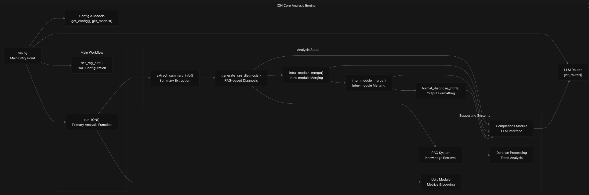

### ION Core

### Overview
The ION Core is the central analysis engine of the IONavigator system that processes and diagnoses I/O performance trace data. It serves as the backbone of the entire pipeline, coordinating various subcomponents to ensure seamless end-to-end trace analysis. Whether logs are ingested via command-line, web interface, or automated workflows, they are ultimately routed through the ION Core for interpretation and diagnostic output. It provides the core functionality for analyzing traces, interacting with language models, performing retrieval-augmented generation (RAG), and generating diagnostic outputs. This includes parsing Darshan log files, extracting relevant performance metrics, querying embedded documentation or research papers through a retrieval system, and leveraging large language models to interpret the findings and suggest performance improvements or root causes of I/O bottlenecks. This page documents the architecture, configuration, and workflow of the ION Core engine. It includes detailed explanations of how different modules interact internally, the role of configuration files in customizing analysis behavior, and the sequence of processing steps that transform raw trace logs into human-readable insights.
---

## System Architecture 
The ION Core Analysis Engine operates as a standalone system that can be invoked directly via command line or through the web application's task management system. The engine follows a modular architecture with distinct components for workflow orchestration, LLM integration, RAG processing, and trace analysis.
---

## Core Architecture Overview

